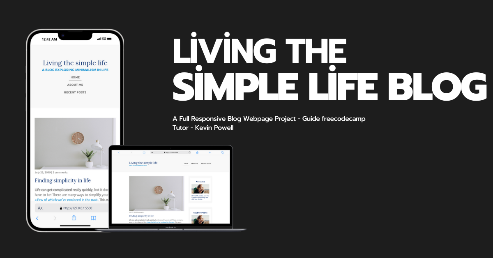

# kevinpowell-fcc-blog

A blog web project built as part of the FreeCodeCamp tutorial series, guided by Kevin Powell. This project showcases the skills and techniques learned throughout the tutorial, including responsive web design, HTML, CSS, and JavaScript. The goal of this project is to create a clean, accessible, and user-friendly blog interface.
<<<<<<< HEAD

 [banner](README.md)

